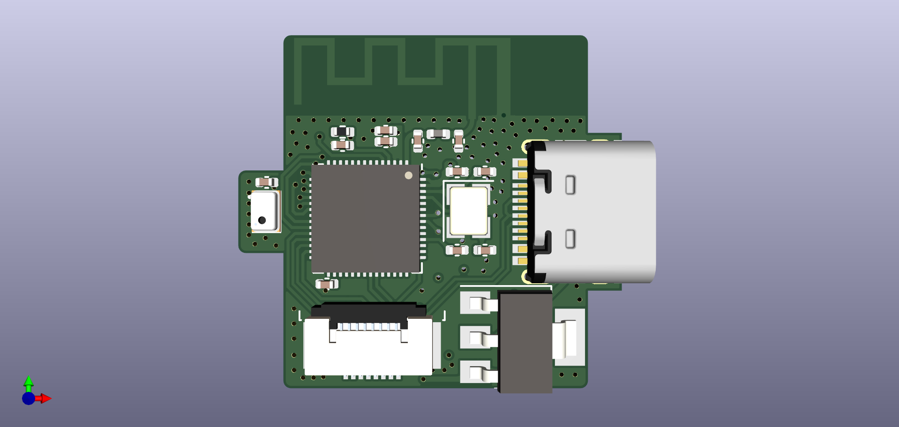

# Holocubic

用 ESP32-S3 重新设计的版本

## 板载资源

- [ESP32-S3FN8 / ESP32-S3FH4R2](https://www.espressif.com/sites/default/files/documentation/esp32-s3_datasheet_en.pdf)
- [WM8978](https://pdf1.alldatasheet.com/datasheet-pdf/view/96647/WOLFSON/WM8978.html) 音频 Codec
- 单声道模拟麦克风
- MPU6050 惯性传感器

## PCB 

